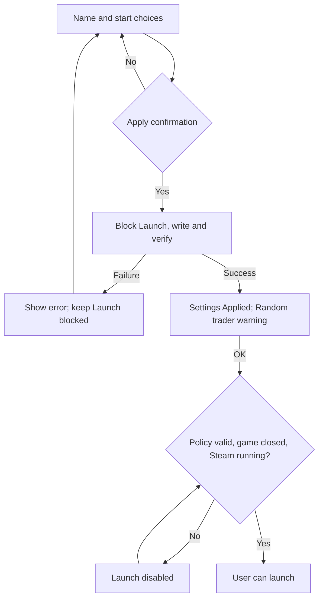

> HRS 1.2.7 DEV carries this workbench from the completed 1.2.6 native UX round. Frozen 1.2.6 references below retain their historical identity; new-version build and QA status are recorded in the lane README and HRS_1.2.7_LANE_WORK_MANIFEST.md.

# Bit Wrecked design recipes

A recipe is a set of presentation choices that tools can repeat. JSON holds the
values; this guide explains the intent; an exported PNG shows the result. The
same choices can guide another renderer without copying a screenshot pixel by
pixel. Everything here uses the dev box's existing Windows graphics facilities.
No downloads, paid application or Mermaid installation are needed.

## The two styles

| Recipe | Target | Intent |
| --- | --- | --- |
| `bitwrecked-quiet` | Manager and release card | Light surfaces, quiet borders, short copy and restrained orange accents. |
| `bitwrecked-contrast` | Release card | Charcoal, white type and one lime highlight; text left, artwork right. |

The manager study keeps its picture-only logo, white outlined Apply button and
a single column. Random-start choices appear when relevant. Its dirty and
**Preview ready** states are simulated; distinct saved, unapplied and verified
readiness wording remains a production requirement. The banner guides hierarchy
and contrast; its lime palette belongs to the release card.

## Change a recipe, then render it

Edit a recipe's JSON once, then open or export it through the workbench. Renderers
use the fields relevant to their target. Palette sets surfaces, text, borders
and accents. Typography sets fonts and type sizes.
Geometry sets spacing and corners; target settings arrange controls or cards.
Copy supplies the short visible labels. Artwork stays a separate image input.
Keep font choices within those installed on the dev box. State must remain clear
in words; accent color alone cannot communicate readiness or failure.

```powershell
Import-Module .\Recipes.psm1
Get-DesignRecipeList
$manager = Get-DesignRecipe -Id bitwrecked-quiet -Target Manager
$card = Get-DesignRecipe -Id bitwrecked-contrast -Target ReleaseCard
```

Run those commands from the parent `NativeGraphics` directory. `-Path` selects
an explicit recipe file instead of the named preset. The loader rejects unknown
fields and unsupported targets. A renderer consumes the returned values;
loading a recipe alone does not redraw a control. An exported PNG is a
review reference generated from JSON and renderer code, not the editable source.
Default cards are 1440 x 810. After changing geometry, fonts or copy, regenerate
the PNGs and review text fit, wrapping, spacing and contrast.

## Mermaid describes behavior

Mermaid is optional. It maps structure and transitions; JSON controls the actual
graphics. This diagram records the real HRS contract for future integration.
The workbench's Apply and Launch actions only simulate preview states.



Keep the real pre-write Yes/No confirmation, readback, separate acknowledgement
and exact Random-mode trader warning in the
[trader-notice contract](../../../../../HRS_1.2.6_TRADER_NOTICE_DEV_MANIFEST.md).
Standard omits that warning. Failure must never show success or clear the Launch
block; success must never launch automatically. Presentation recipes cannot
replace those rules or promise that Apply proves an in-game landing or trader.

The workbench remains a DEV study. The real manager now consumes an embedded
copy of the Quiet recipe and native control source, generated by
`Sync-ManagerDesign.ps1` in the parent directory. After editing a recipe or the
controls, run that tool and rerun the real manager checks. `-Check` reports stale
or missing generated data without changing it. The customer needs only the
existing manager file and package inputs; no workbench directory is required.
Frozen `1.2.6-qa.001` remains separate. Actual monitor DPI, Windows high contrast
and operator review remain pending; exported scale previews do not prove them.
