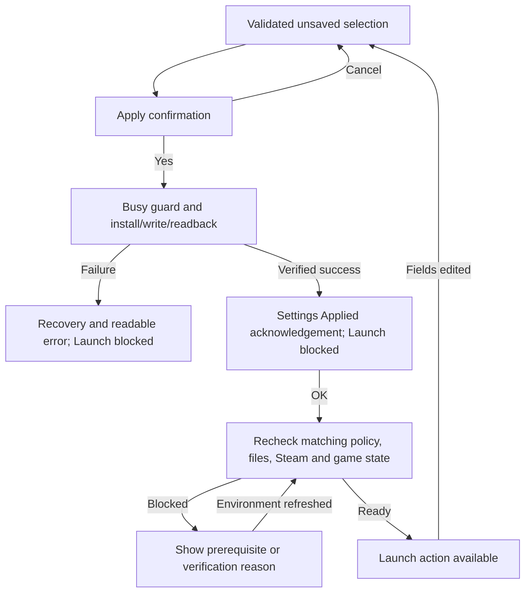

# HRS native UX next DEV manifest

Revision: **2**, updated **2026-10-04**. Owner: **Bit Wrecked**. Revision2 completes internal/external copy, reachable help and newcomer acceptance.

Status: **Ready for DEV implementation and return to QA.** The reviewed prototype is not a qualified customer release. Gameplay mechanics remain outside this UX work; the known trader-session boundary remains in force.

This packet consolidates the compact-manager work, Microsoft design review and remaining sizing failures. Use the [native UX doctrine](HRS_NATIVE_UX_DOCTRINE.md) for durable rules and recipe values. Use this manifest for implementation order, acceptance and the return packet.

Start from the [DEV packet index](dev-handoff/hrs-native-ux/START-HERE.md). The scope is native UX refinement: compact presentation, explicit selection/state, guarded operations, help/copy and geometry/accessibility qualification. Preserve gameplay mechanics. Optional motion and the larger assisted QA harness remain separate follow-up work.

## Reference materials and current status

| Material | Identity and use |
| --- | --- |
| Frozen customer baseline | `1.2.6-qa.002`; preserve its ZIP, extracted package, receipts and evidence |
| Prototype | `prototypes/hrs-1.2.6-compact-header/HistoricalRandomStart_1.2.6` |
| Prototype entry | Its own `START.bat`; native manager `dev/ui/p0158.ps1` |
| Prototype revision | 14; previewOnly=true; releaseQualified=false |
| Prototype manager SHA-256 | `BF1275FC94CF7CFD40E6F080C7821DE2DCAA50C8651A82E09ED2602515B395B6` |
| Frozen manager SHA-256 | `5886C75BEF29F29E374A0B61D2F323A9FD86A7E3C610D92AF367A4CF7C8D4FA3` |
| Frozen customer ZIP SHA-256 | `F578291FBC41E87F2C06C82CB9F4157C7F46BC66B8D2DC0D1D734F63CA385FA5` |
| Frozen runtime SHA-256 | `E5EA99BBD4DBAE122264835CC2090157F3A549C0E6FB379EB5DF5860EEF56D7B` |
| Structured decisions and captures | [preview-summary.json](prototypes/hrs-1.2.6-compact-header/preview-summary.json) |
| Source comparison | [compact-header.patch](prototypes/hrs-1.2.6-compact-header/compact-header.patch); reference diff, not an upstream generator input |
| Observed sizing failures | [QA review](QA-REVIEW-1.2.6-qa.002.md), [gallery](qa-review/1.2.6-qa.002/ui-sizing/index.html), [structured findings](qa-review/1.2.6-qa.002/ui-sizing/sizing-findings.json) |

### Implemented and reviewed in the prototype

- Single-row logo/title/release header; 16pt title, 28-unit logo, compact padding and margins.
- Removed redundant name, biome, protection, heading and selection-note rows. Retained biome weight statistics and Edit weights.
- Small amber/green state badge beside Apply, with text; current badge is 8pt.
- Clear enabled/disabled button colors and normal enabled Uninstall text through the Secondary role.
- Manual Restore omitted from the layout and keyboard navigation. Its dormant object/callback remains in the prototype for existing references.

The prototype keeps the method dropdown. Its text-matching status presentation, 8pt badge and disabled-color string override describe the reviewed implementation. The explicit state model, larger badge, radios, ownership-aware availability and busy guard below are production work.

Latest layout evidence is [round64](prototypes/hrs-1.2.6-compact-header/screenshots/round-64-uninstall-enabled-final.png), at actual 200% primary scaling. Earlier captures cover additional layouts; qualification varies by revision. [Round55](prototypes/hrs-1.2.6-compact-header/screenshots/round-55-highlight-applied-visual-fixture.png) simulates the green state with dangerous callbacks neutralized and shows earlier maintenance UI. It is not a live Apply pass.

### Remaining qualification

Three sizing failures were demonstrated on the frozen baseline. Compaction does not close them. Full live keyboard/Narrator/High Contrast and current-candidate Apply, acknowledgement, failure, launch, removal and gameplay checks remain outstanding. The local game differs from DEV's qualified b17 assembly, so record its actual identity and limit claims accordingly.

## Requirements and evidence

| ID | DEV requirement | Required demonstration |
| --- | --- | --- |
| NUX-01 | Integrate compact header, copy removal and reviewed colors through the upstream recipe/control source; regenerate the manager | Source/recipe hashes, reviewed normal/narrow layouts and no shipping source-string override |
| NUX-02 | Replace the method dropdown with three vertical native radios in an independent parent group | Exactly one method; Standard/Random independence; mouse and native keyboard agree |
| NUX-03 | Use one validated Any/Chosen/Weighted value; batch saved-policy loading and refresh afterward | Saved modes/biomes/weights restored correctly; invalid values rejected; no transient wrong selection |
| NUX-04 | Keep dependent picker/editor positions stable and preserve unsaved values while switching modes | Inactive controls clearly disabled; weight-editor cancel and mode changes perform no writes |
| NUX-05 | Render state text/colors from explicit state; use inherited 10pt body size for badge and recheck compact layout | Wording changes cannot change gates; readable pending/ready/error messages at supported scales |
| NUX-06 | Guard confirmed Apply and Uninstall work against duplicate/conflicting actions; give truthful processing feedback | No overlapping mutations; correct success/error/acknowledgement sequence; measured processing duration |
| NUX-07 | Align Uninstall availability with read-only ownership/process checks and retain its final click checks | Owned, absent, unowned and unknown installations have correct action/reason; unrelated files preserved |
| NUX-08 | Remove manual Restore UI and its dedicated dead references/documentation | Consistent GUI/README/case registry; automatic failed-Apply byte recovery still works |
| NUX-09 | Fix HRS-UX-001/002/003 without losing user sizing | Stable outer width, work-area bounds and complete scroll reachability after equivalent stress sequences |
| NUX-10 | Qualify actual accessibility and display profiles | Tab/arrows/Space, focus, dialog Enter/Escape, Narrator, High Contrast and real-scale screenshots |
| NUX-11 | Preserve gameplay policy, trader notice, compatibility, EAC/Harmony and current launch/write safeguards | Fresh customer-path integration and scoped human gameplay evidence |
| NUX-12 | Return a new immutable QA candidate with updated documentation, contracts and exact identities | New candidate ID/archive/receipt/manifests; valid release/transfer checks; frozen qa.002 unchanged |
| NUX-13 | Provide discoverable keyboard/Narrator-reachable Help or a local README link without restoring removed main-screen paragraphs | New user can find Game Name/world distinction, weight meaning, protection limits and Apply/acknowledgement/Launch guidance |
| NUX-14 | Integrate the copy contract and consistent external drafts; distinguish rejection, verified recovery and uncertain recovery | Conditional fallback, correct Random/Standard notice matrix, exact summaries, safe native key behavior and truthful outcomes |
| NUX-15 | Run one scoped newcomer usability review on the new customer package | Uncoached task observations, assistance/confusion recorded, readable findings and targeted retests |

## DEV implementation recipe

1. **Establish the source baseline.** Locate the upstream native recipe, controls source and `Sync-ManagerDesign.ps1`. These generator inputs were not included in the QA transfer. Merge the reference changes into current DEV source instead of replacing newer work with the copied manager.
2. **Integrate reviewed presentation and help.** Apply doctrine tokens, bounded header, compact layout, retained statistics, status placement, disabled rendering and Uninstall role. Collapse empty helper rows. Add reachable Help/local README access; retain full warning/error/progress messages and accessibility descriptions.
3. **Implement selection projection.** Give each native method radio an explicit Any/Chosen/Weighted identity. Handle only checked=true transitions; suspend refresh during complete policy restoration. Reject unknown modes and invalid indices. Use one setter/projector for both restored policy and user input. A hidden combo may aid a temporary prototype but must not become a second authoritative state.
4. **Implement state and guards.** Separate selection, operation state, verified readiness and presentation. Keep validation and current environment/ownership gates. Acquire the busy guard after confirmation and before mutation; all status refreshes/events must consult it. Disable conflicting actions and hold the guard through verification and required acknowledgement, then clear it safely through success/failure cleanup. Preserve failure recovery and the failed-Apply launch block. Steam availability affects Launch independently of the applied configuration badge.
5. **Preserve the Apply sequence and integrate copy.** Keep pre-write Yes/No confirmation, perform install/write/readback, then show Settings Applied. Use the [copy contract](dev-handoff/hrs-native-ux/UI-COPY-CONTRACT.md) for conditional fallback, Random-only warning, exact summaries and truthful recovery outcomes. Launch remains blocked while acknowledgement is pending. After acknowledgement, require current matching policy, verified files, Steam running and game closed. A failed Apply has no success popup. Returning after starting Steam refreshes availability.
6. **Complete removal simplification.** Remove manual Restore UI and dedicated dead references. Retain policy/history needed by other contracts and automatic transaction recovery. Update documentation and the new candidate's affected cases; the frozen case ledger remains historical evidence.
7. **Fix geometry.** Preserve outer width when fitting height, clamp final outer bounds to the current monitor's work area and recalculate scrolling after layout settles. Review the weights dialog's related sizing assignments. Preserve intentional resizing through refresh, minimize/maximize and monitor moves.
8. **Measure and qualify.** Start with immediate feedback and readable busy text. Current Apply is synchronous; measure responsiveness before deciding whether it needs background work. Qualify controls and actual display profiles through the acceptance matrix and [newcomer checklist](dev-handoff/hrs-native-ux/NEWCOMER-USABILITY-CHECKLIST.md).
9. **Package the return.** Regenerate recipe/control provenance and the manager, then create a new candidate with matching archive, receipt, manifests and QA definitions. Return source changes, evidence and limitations together.

### Apply and launch state relationship

This is the required behavior for integration; it does not claim the proposed state implementation exists already. Animation completion never participates in this flow.

## Focused acceptance matrix

Use the new candidate's freshly extracted customer `START.bat`. Identify every screenshot by candidate/hash, display profile, mode/state and live versus fixture scope. Keep component simulations separate from real operation tests.

| Area | Required sequence and result | Evidence |
| --- | --- | --- |
| Header and copy | Normal, minimum and maximized manager; readable title/release; retained stats; no redundant blank rows | Settled screenshots and source comparison |
| Selection | Load Standard and saved Any/Chosen/Weighted; switch repeatedly; alter/cancel weights; validate missing/invalid selections | UI/policy observations; unchanged disk bytes for selection-only actions |
| Status and buttons | Pending, busy, acknowledgement, ready and blocked; mouse/keyboard focus; disabled press attempts | State/gate observations and captions that match actual scope |
| Apply | Success, safe induced failure, popup cancel, acknowledgement, Steam closed then started, settings edited after Apply | Actual write/readback, recovery and launch-state evidence |
| Removal | Owned HRS, absent folder, unowned/mismatched files, game running, user cancel and success | Preflight/final checks and before/after inventories |
| HRS-UX-001 | Repeated Any/Chosen/Weighted/editor changes at real scales; include the failing 150% sequence | Outer-width measurements without cumulative shrink |
| HRS-UX-002 | Short and long layouts; repeat fits near screen bottom and move monitors | Final outer bounds within the actual work area |
| HRS-UX-003 | Genuine minimum resize and scrolling at 100/150/200/225%, including the original 200% reproduction; repeat after selection changes and dialog returns, then restore normal size | Every action/Game details reachable; correct scroll extent |
| Display and accessibility | Real primary 100/150/200/225%, secondary 300%; keyboard, Narrator, High Contrast and popups | Current measured host/profile and reviewed captures; no synthetic DPI claim |
| Trader lifecycle | Operator reaches first assignment in one session; then assignment/re-entry checks required by the case | Current save/session/logs and human milestone/frame evidence |
| Reachable help | Find essential removed explanations from the compact manager; review exact Game Name, weights and protection before Apply | Keyboard/Narrator access and newcomer comprehension observations |
| Confirmation copy | Standard excludes Random-only fallback/warning; Any/Chosen/Weighted with protection off/on include the correct pre-write and post-write text | Actual popup/policy agreement, safe cancellation and native default/Enter/Escape observations |
| Errors/recovery | Missing/invalid name, all-zero weights, Steam closed, game running, ownership conflict and unwritable folder; safe isolated recovery failures | Specific next action, preserved selections and verified outcome; no false success |
| Newcomer flow | Freshly extracted package, realistic goals and ordinary help without coaching | Current-run observations, assistance, misunderstandings and targeted retests |

The first trader destination may be outside the landing biome when a valid fallback is selected. Distinguish that from a missing route decision. The known early exit before assignment remains disclosed; it is not repaired by the popup. An uninterrupted missing decision or lost already-assigned destination remains a blocker under the existing contract.

## Recipe and QA tooling additions

The [QA harness manifest](HRS_QA_HARNESS_ARCHITECTURE_MANIFEST.md) continues to define assisted replay and the human gameplay handoff. Add these UI-specific capabilities as small extensions:

- Validate allowed recipe values and effect names, provenance and bounded durations. Separate operational state from display copy and effect settings.
- Provide harmless fixtures for control Normal/Hover/Pressed/Focused/Disabled and status Pending/Applying/Awaiting acknowledgement/Ready/Blocked. Neutralize install, launch and uninstall handlers; label output as presentation simulation.
- Capture a settled screenshot after each sizing round. Record actual Windows scale, monitor/work area, window bounds, selection, explicit state, High Contrast, effective animation preference and candidate/recipe/control hashes.
- Wait for explicit state and bounded rendering completion. Never treat a timer, a dispatched click or a green fixture as operation success. Preserve timeouts, focus/capture failures and ambiguous results.
- Qualify actual native selectors. The local provider's generic Pane observations require host investigation or bounded profile-specific fallback; they do not prove keyboard/Narrator behavior.
- Reuse human-approved expected results only within their declared applicability. New candidates still require fresh observations and affected-case replay; starter gameplay remains the operator's task.

### Optional motion follow-up

Motion remains deferred with default duration **0ms**. A future **120ms paint-only accent** may be reviewed as an HRS trial after state, guard and geometry work. It must respect the read-only Windows animation preference; off/query failure/High Contrast use instant rendering. State text and action gates update immediately, while hit targets and layout stay fixed.

If implemented later, return initial/intermediate/settled captures, rapid-state/disposal tests and a brief smoothness review. Stop obsolete effects and dispose idle timers. No sleeps, artificial Apply delay or nested event pumping are permitted to keep effects running. These conditional checks do not require an animation subsystem for this delivery. Microsoft sources and host scope are recorded in the doctrine and summary.

## Challenges and resolutions

| Challenge | Required handling |
| --- | --- |
| Prototype uses exact strings and 8pt state text | Preserve appearance intent; implement explicit state and review 10pt body text |
| Generator inputs absent in QA transfer | Integrate at DEV using actual upstream recipe/control source and regenerate |
| Radio events and saved-policy restore can expose partial state | Checked-only handlers, batch restore and one validated projector |
| Current synchronous operation may block an animated indicator | Truthful static busy feedback; measured duration before threading; retain guard/recovery |
| Disabled availability can race with environment/ownership changes | Refresh read-only availability and repeat authoritative checks at action entry |
| Narrow layouts and compatibility scaling | Reproduce observed geometry failures and qualify actual host/scales |
| Current installed payload drift or untested game build | Record as environment evidence; use controlled candidate fixtures for qualification |
| Removing Restore affects inherited README and cases | Update the new candidate's docs/registry and verify automatic recovery separately |
| Early trader-session exit remains possible | Preserve marker-boundary warning and public known-issue copy; retain human gameplay tests |

## DEV return checklist and publication boundary

### Internal and external paperwork

| Surface | Completed draft and integration requirement |
| --- | --- |
| UI language | [Copy contract](dev-handoff/hrs-native-ux/UI-COPY-CONTRACT.md); bind text to explicit state and verified outcomes |
| Human usability | [Newcomer checklist](dev-handoff/hrs-native-ux/NEWCOMER-USABILITY-CHECKLIST.md); perform on the returning customer candidate |
| Customer instructions | [README draft](dev-handoff/hrs-native-ux/external/README-DRAFT.md); reconcile Help and delivered behavior |
| Release summary | [Release notes draft](dev-handoff/hrs-native-ux/external/RELEASE-NOTES-DRAFT.md); publish only implemented/qualified changes |
| Public listing and optional site | [Nexus draft](dev-handoff/hrs-native-ux/external/NEXUS-LISTING-DRAFT.md); complete final version/build fields and real addresses |
| Known issue/support | [Notice draft](dev-handoff/hrs-native-ux/external/KNOWN-ISSUE-DRAFT.md); preserve assignment boundary and valid fallback distinction |

These drafts are outside the frozen customer package. Fill release version, candidate ID, actual tested build, archive identity and QA/release decision from the return packet. Keep optional website work scoped to an available site. Neither external copy nor its identity fields are authority to publish before release approval.

### Required return

- Current source commit/diff, recipe/control revisions and generated-manager hash; identify any launcher changes and show preserved runtime/gameplay scope.
- New candidate ID, customer archive, receipt, package/transfer manifests and successful validation output.
- Updated README, release notes, Nexus draft and QA case definitions covering the omitted manual Restore action and retained recovery behavior.
- Acceptance matrix with fresh observed results, exact host/game/display identities, screenshots and transaction evidence. Mark unperformed checks explicitly.
- Resolved sizing findings with equivalent retests; accessibility findings and remaining manual capabilities.
- Harmless fixture provenance separate from live install/launch/removal and human gameplay evidence; all unresolved failures/dispositions disclosed.
- Completed copy matrix and newcomer review; reconcile all public surfaces with delivered behavior and finalized release fields.

The frozen **1.2.6-qa.002** case ledger has 41 required cases still Pending; its recorded sizing attempt failed. This packet does not alter that history or close those cases. Publish only the newly identified candidate after its required QA and release-owner approval. A larger automation platform and optional motion are not prerequisites for that decision.
