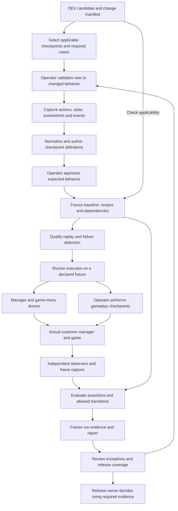
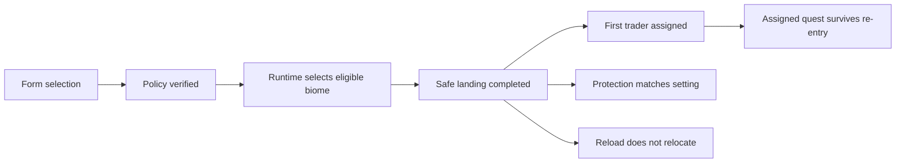
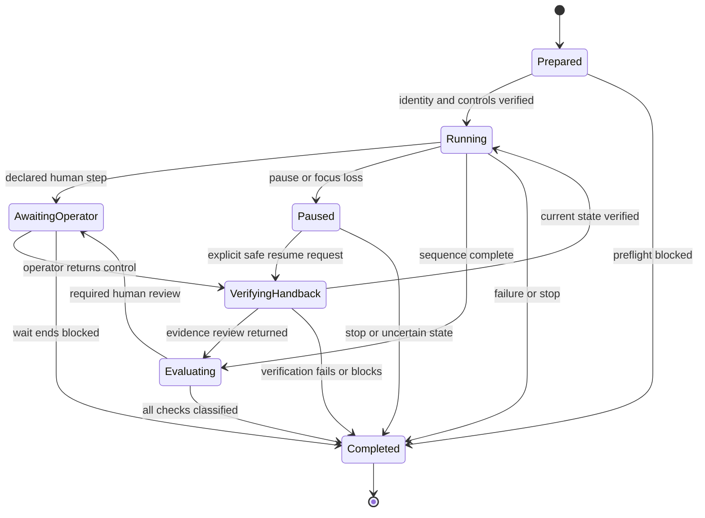

# HRS QA harness architecture manifest

Status: **Complete DEV handoff for implementation; harness proposed, not implemented or qualified.**

Created: **2026-10-04**.

Manifest revision: **3**, updated **2026-10-04**. Revision2 added native UX/capture requirements; revision3 adds human comprehension/copy evidence and the complete paperwork links in section17. The first assisted implementation contract remains in force; harness revision is separate from the HRS product version.

Owner: Bit Wrecked. First reference package: **HRS 1.2.6-qa.002**.

## DEV delivery brief

Build one useful assisted case first: verify a candidate, operate its customer manager, collect fresh observations, hand gameplay to the operator through first trader assignment, verify handback, and produce a readable result with existing-format QA evidence when the full case is satisfied.

| Delivery decision | First implementation |
| --- | --- |
| Runtime and packaging | Windows PowerShell 5.1, one shared module, and a small native WinForms status/control view; source outside frozen customer packages |
| Supported fixture | One measured Windows/display/language/binding profile and one declared world; unique test saves |
| Definitions | Manually authored JSON, operator milestone annotations, reviewed reference frames, and explicit case/check bindings |
| Manager | Qualified native control actions, actual write/readback observations, popup and launch-state captures |
| Game menus | Automate each action only after qualification; unsupported menu actions become declared operator steps |
| Gameplay | Operator completes opening tasks through assignment; operator travel/interaction only when the selected case requires it |
| First complete case | `HRS-QA-TRADER-FIRST-SESSION`; later add the separate post-assignment/reload cases |
| Proof of reuse | Capture and approve a definition, then run its automated portions on a second fresh save without editing that definition; retain a fresh human gameplay segment |
| Outputs | Current-run observations, action/handoff journals, case result, sanitized evidence export or diagnostic report, and one short summary |
| Success measure | Less active operator work on setup, checking, and reporting; required evidence and failure detection remain complete |

The logical records and interfaces below can share a module and a few files. DEV may begin with one runner entry point, existing QA tools, and manually reviewed definitions. Separate scripts only when useful to the operator. The required first-delivery controls are identity checks, truthful evidence, approval/provenance, bounded input, stop/takeover, exclusive ownership, explicit human handoffs, and honest outcomes.

Defer automatic gesture-to-script conversion, generic image recognition, automatic change-impact planning, broad profile support, multiple laptops, scheduled batches, automatic restart/resume, and statistical distribution testing. These are possible later capabilities, not prerequisites for the first assisted case. The agreed gameplay boundary applies throughout this manifest.

## 1. Objective and working agreement

Turn an operator's validation of a feature into a versioned, repeatable test. Capture what the operator did, the conditions under which it worked, and the visible and recorded results they accepted. Give the machine a way to repeat qualified actions, capture current human milestones, and check the accepted results on subsequent candidates.

The operator reviews new or changed behavior and any results requiring judgment. Automation repeats qualified sequences, checks their integration with existing behavior, and retains evidence. Human approval of expected behavior can be reused within its declared scope. Every execution produces new observations and a new outcome.

**Agreed scope (2026-10-04):** Build a practical assisted QA harness. Automate manager setup, qualified game-menu operations, observation, evidence collection, and result checks. The operator performs starter gameplay through first trader assignment, plus travel and trader interaction when a case requires quest completion. Autonomous gameplay, navigation, combat, and resource gathering are outside this implementation's scope. Cases containing those human steps remain supervised; automation can run their qualified segments around the handoff.

At a planned gameplay handoff, release synthetic input, record the pending operator step, and retain the same game session through trader assignment. Resume automated actions after an explicit operator handback and verification of the required current state. Keep each operator observation tied to the current run. Human judgment remains available for changed features and checks without a qualified observer.

The reusable record must contain **conditions, actions, expected results, sequence, dependencies, and approval**. A recording of gestures or a list of successful log messages is insufficient to establish all of these.

This manifest specifies tools and contracts for DEV to implement. It does not start a gameplay run, change the frozen customer package, certify automation, or complete the current 41 pending QA cases. See [the current review](QA-REVIEW-1.2.6-qa.002.md) and [the trader-session handoff](HRS_TRADER_SESSION_NEXT_DEV_MANIFEST.md).

## 2. Architecture



The applicability check determines whether existing baselines can be reused. Missing baselines and unclear change impact return to human review. Failed or ambiguous qualification keeps the affected sequence in supervised testing.

### Components and proposed responsibilities

| Component | Responsibility |
| --- | --- |
| Definition registry | Checkpoint IDs, revisions, expected results, dependencies, profiles, and approval references |
| Operator capture tool | Bounded recording of actions and observations in the declared manager/game windows; operator annotations |
| Normalizer | Convert observations to documented units and identifiers while retaining original evidence |
| Recipe planner | Select required cases, expand dependencies, validate sequences, and identify required fixtures |
| Runner | Execute actions, wait for observed states, enforce bounds, journal progress, and classify results |
| Manager driver | Launch the actual customer `START.bat`; operate WinForms controls and native modal dialogs |
| Game-menu driver | Operate launch, save creation, load, and exit menus after qualification; coordinate the explicit gameplay handoff |
| Observers | Read UI properties, installed files, policy/result readback, runtime events, and game frames independently of action completion |
| Evaluator | Check predicates, branching rules, visual requirements, timing, and required evidence |
| Evidence adapter | Produce candidate-bound observations and export through existing QA tools where their contracts permit |

Begin with Windows PowerShell 5.1 and small .NET helpers, matching the supplied manager and QA tools. A QA-only helper may use WinForms, UI Automation, and Windows input APIs. Keep it outside the customer payload. A new dependency needs a specific purpose and a documented installation/version requirement; none is required by this manifest yet.

Microsoft UI Automation provides control properties and patterns useful for desktop testing. Selectors must include the target application/window context: Automation IDs are not globally unique or guaranteed stable across application releases. [Microsoft UI Automation testing guidance](https://learn.microsoft.com/en-us/windows/win32/winauto/uiauto-usefortesting)

Windows `SendInput` supplies keyboard/mouse events, subject to integrity-level restrictions and existing keyboard state. The game pilot must prove accepted input and resulting state changes; an API call returning successfully is not proof of gameplay success. [Microsoft SendInput reference](https://learn.microsoft.com/en-us/windows/win32/api/winuser/nf-winuser-sendinput)

## 3. Requirements

| ID | Required behavior | Acceptance evidence |
| --- | --- | --- |
| QA-HAR-001 | Authenticate the candidate archive, receipt, companion, context, and extracted workspace before executing a case. | Identity report; reject a deliberately altered fixture |
| QA-HAR-002 | Record actual game identity, OS, harness/driver versions, display profile, language, input bindings, world fixture, EAC state, and other active mods. | Environment record with measured values and evidence sources |
| QA-HAR-003 | Keep baselines, recipes, human approvals, and execution results as separate versioned records. | Approval references frozen definition hashes; each replay has a fresh run ID |
| QA-HAR-004 | Capture an operator's approved actions and their visible/state results without silently inferring approval. | Operator annotations and a baseline approval record |
| QA-HAR-005 | Normalize only declared incidental differences. Preserve raw evidence and meaningful state. | Normalization rules, before/after samples, and failure-detection qualification |
| QA-HAR-006 | Use typed, inspectable operations/selectors for automated steps and explicit handoffs for operator steps. | Action/handoff journals and evidence of the intended controls/states |
| QA-HAR-007 | Express preconditions, postconditions, allowed branches, invariants, and bounded waits for every checkpoint. | Definition validation; missing/forbidden transitions detected |
| QA-HAR-008 | Reset to a declared fixture between independent cases. Continuation cases explicitly name retained state. | Fixture digest, unique test-save mapping, and verified starting state |
| QA-HAR-009 | Evaluate results using observations independent of driver completion. | Cross-checks between UI/game frames and policy/result/events |
| QA-HAR-010 | Compare variable gameplay against approved predicates and allowed branches. | Biome/placement/trader assertions; no requirement to duplicate an uncontrolled random location |
| QA-HAR-011 | Map feature dependencies and changed implementation components to affected checkpoints. | Selection report with reasons; unresolved impact requests review |
| QA-HAR-012 | Bind events, actions, frames, and observations to the actual run/case/attempt and each observed login session. Permit only recipe-declared session transitions. | Reject stale logs or another save/candidate/attempt; preserve legitimate reload evidence |
| QA-HAR-013 | Every Pass requires all mandatory assertions and evidence, and a qualified observer for each automated claim. | Deliberate omission or unavailable observation cannot produce Pass |
| QA-HAR-014 | Freeze exported evidence and retain its manifest, hashes, definition references, and provenance. | Export validates against the exact run and candidate |
| QA-HAR-015 | Provide pause, stop, operator takeover, and bounded recovery. Release held input and cease automation on takeover. | Focus-loss, cancellation, timeout, and interruption tests |
| QA-HAR-016 | Preserve checkpoint progress/evidence after interruption without repeating uncertain writes or game transitions. The first implementation ends uncertain attempts and starts fresh. | Interrupted-attempt report and state reconciliation; no automatic resumption from a started action |
| QA-HAR-017 | Human approval applies to the declared behavior and profiles. Changes invalidate affected approvals or driver qualifications according to explicit rules. | Baseline applicability report |
| QA-HAR-018 | Required release coverage and publication authority remain enforced. | Missing current-candidate cases block approval; harness cannot publish or approve for the owner |
| QA-HAR-019 | Qualify the checker against controlled failures as well as successful runs. | Demonstrated detection of wrong results, missing evidence, and out-of-order events |
| QA-HAR-020 | Keep customer execution, isolated component checks, and DEV simulations distinguishable. | Run provenance prevents simulation results being counted as customer gameplay QA |

### Fixture and execution boundaries

Fixtures declare permitted game/manager roots, test-save names, worlds, and any files the harness owns. Resolve absolute paths and reject escapes or reparse-point ambiguity before writing or cleaning fixtures. Keep a bounded cleanup inventory. Preserve personal saves, unrelated mods, and game binaries.

Use the released customer path for end-user acceptance cases. Direct policy construction, an internal callback invocation, teleport commands, or a changed game DLL may be useful in separate component experiments; they do not substitute for that path's acceptance evidence. The existing `-SmokeTest` controls check retains its documented no-install scope.

The initial driver uses ordinary desktop/game interaction and read-only observation. Do not introduce persistent trader-route state, a player tag, process memory injection, or anti-cheat bypass as a harness implementation shortcut. Additional runtime telemetry, if necessary, goes through DEV as a separately reviewed candidate change. Until an observation is available, its assertion remains unverified.

For the desktop driver, verify an accessible interactive desktop, the expected target process/window, and usable capture before sending input. Detect lost focus or changed window geometry, release held input, and suspend the action sequence. A coordinate-only selector must have a declared display profile, a verified visual anchor, and bounds. The first pilot must determine whether real game frames can be captured reliably; an empty, stale, or obscured frame is unusable evidence.

## 4. Data contracts and normalization

### Proposed records

| Record | Minimum fields |
| --- | --- |
| Feature/change manifest | Feature ID; changed components; behavior changes; affected dependency interfaces; source/candidate identities; unresolved impact |
| Checkpoint definition | Schema; stable ID; revision; feature; mapped QA case IDs; required/provided states; dependencies; profile applicability; predicates; evidence requirements |
| Replay recipe | Schema; ID/revision; input/fixture bindings; ordered automated actions and operator steps; checkpoint references; branch rules; handoff/handback conditions; wait deadlines; attempt limits; cleanup/continuation rules |
| Baseline manifest | Digests of checkpoint definitions, recipe, selector map, normalization rules, assertion definitions, and reference evidence |
| Human approval | Operator reference; UTC timestamp; baseline-manifest digest; observed run/evidence digest; accepted scope; unresolved items |
| Driver qualification | Driver/observer/evaluator identities; baseline digest; profiles/operations proved; successful replay evidence; controlled-failure evidence |
| Run context | Plan/attempt/run/case IDs; ordered game-session bindings; candidate and contract digests; baseline and tool identities; measured environment; fixture identity; supervised/unattended mode and declared operator steps |
| Checkpoint observation | Input action references; raw/normalized values; source and capture time; predicate results; evidence links; observer identity |
| Run result | Outcome/reason; required/observed/failed assertions; branch taken; qualification; evidence manifest digest; human review requests |
| Handoff journal | Step/handoff/run/session IDs; instructions and required milestones; deadline; operator acknowledgement/handback; current attestations; interruptions; evidence references |
| Case bindings | Exact contract case/check/evidence names; mandatory subscenarios; assertion mappings; permitted producer kinds; required artifacts and qualification |

Machine observations must identify their producer. Preserve operator confirmations as operator confirmations; replay does not copy those confirmations into a new run. A machine may satisfy the same check only through a qualified observer/evaluator and an approved mapping of its evidence to that check.

Freeze definition files as UTF-8 with an explicit newline policy. Hash their exact bytes. Store human approval in a separate file referencing the baseline manifest, avoiding a self-referential digest. Hash artifacts/screenshots before any transformation and hash normalized outputs separately. Apply Git byte-preservation rules to frozen baseline/evidence bundles when implementation introduces them; current release packages already need exact-byte handling.

### Normalization rules

| Value | Normalize | Retain for evaluation |
| --- | --- | --- |
| Time | UTC for correlation; monotonic elapsed time within a run | Event order, session boundaries, and deadlines |
| File location | Logical fixture alias in portable records | Exact artifact hashes and locally resolved paths |
| UI geometry | Coordinates relative to a verified client area when a recipe requires them | Display scale, bounds, visibility, clipping, and focus |
| Game state | Documented units, canonical biome IDs, typed booleans/enums | Actual biome, coordinates/tolerances, quest/trader identity, policy revision, and lifecycle |
| Random output | An approved allowed set or predicate | Requested weights, eligible pool, selected value, fallback reason, and observed result |
| Images | Declared region crops and explicitly reviewed masks | Original frame and visible information needed to detect the defect |

Do not broadly strip error messages, dismiss dialogs, mask quest markers, or normalize a wrong destination into the approved destination. An example image helps define expected appearance; exact whole-screen pixel equality is unsuitable for moving terrain, lighting, and uncontrolled random outcomes.

A missing selector ID or name change is a mapping change to review, not permission to click the nearest available button. Baselines for actual Windows scaling, language, themes, and input bindings must say which profiles were observed. Synthetic form scaling cannot satisfy an actual OS-DPI requirement.

## 5. Operator-to-machine workflow

1. **Prepare.** Authenticate the candidate, declare the environment/fixture, start a new evidence run, and identify the new feature's acceptance requirements. Preserve unknown requirements as open questions.
2. **Observe the operator.** Capture a bounded sequence with before/after frames, relevant state and events, and the operator's explanation of expected behavior. Recording may begin with explicit milestone annotations; a comprehensive gesture recorder is not required for the first version.
3. **Author.** Translate gestures into semantic actions, identify checkpoints, define predicates, and include expected error/cancel/fallback branches. Record preconditions and what must remain true in existing behavior.
4. **Review the definition.** The operator confirms the expected behavior and applicability. A capture is evidence; it does not automatically approve every state in it or establish all untested branches.
5. **Freeze.** Record the baseline manifest and human approval. Preserve the observation that supplied the reference.
6. **Qualify automation.** Replay on a fresh declared fixture. Confirm observable outcomes against the operator's baseline and demonstrate that controlled failures are detected. Qualify operations/profiles individually.
7. **Repeat.** Execute applicable recipes with new evidence for the current candidate. Reuse expected definitions and mappings within scope.
8. **Reconcile.** Review exceptions and impact reports, then supply current-candidate coverage to the release gate. The release owner makes the release decision.

### Dependency and change mapping

Model checkpoints as a directed acyclic dependency graph. Validate unique IDs, resolvable references, revisions, and compatible required/provided state contracts. Iteration such as retries or logout/re-entry belongs in a bounded recipe, not a dependency cycle.

For a biome-selection change, the affected paths may include **form selection -> policy write/readback -> runtime selection -> landing -> trader routing**, with protection and one-shot reload invariants. Select the changed checkpoint and all declared downstream consumers; include prerequisites and any shared-component consumers. A shared policy-codec or driver change has broader impact than a text-only copy change.

Use DEV's change manifest together with source/component fingerprints and dependency records. If they disagree or mapping is incomplete, require review and broader applicable coverage. No assertion of unchanged behavior is inferred solely from a feature label.

Unchanged expected definitions can carry forward. Passing execution records remain bound to the candidate and environment that produced them. The current release contract requires fresh coverage of its required cases; selective change mapping does not waive those cases. Reducing a future release's required suite needs an explicit, versioned DEV/QA contract decision.



These are proposed checkpoint relationships. Predicate evaluation must distinguish a supported fallback from a failed assertion and check the observable result at each boundary.

## 6. Example checkpoint definition

The following JSON is an illustrative **draft definition**, not an approval or an executable harness. The paths name proposed typed observer fields. Implement the field registry, selectors, predicate evaluator, and bindings before executing it. `readbackVerified` means the observer independently compares expected settings and installed inventory with actual readback; it cannot be set from an Apply-success log alone.

```json
{
  "schema": "hrs-qa-checkpoint/v1",
  "checkpointId": "hrs.manager.settings-applied",
  "revision": 1,
  "featureId": "hrs.manager.apply",
  "qaCaseIds": ["HRS-QA-TRADER-NOTICE"],
  "dependencies": ["hrs.manager.valid-selection"],
  "requires": ["hrs.manager.selection-ready"],
  "provides": ["hrs.settings.verified-awaiting-acknowledgement"],
  "recipeId": "hrs.manager.apply-random",
  "profileId": "windows-manager-pilot",
  "parameters": {
    "gameName": {"binding": "fixture.gameName"},
    "mode": {"literal": "Random"},
    "selection": {"literal": "Chosen"},
    "chosenBiome": {"literal": "Wasteland"}
  },
  "preconditions": [
    {"field": "process.game.state", "op": "eq", "value": "Closed"},
    {"field": "manager.selection.valid", "op": "eq", "value": true}
  ],
  "sequence": [
    {"action": "manager.invoke", "target": "ApplySettings"},
    {"waitFor": "manager.confirmation.visible", "timeoutMs": 10000},
    {"action": "manager.invoke", "target": "ConfirmYes"},
    {"waitFor": "manager.settingsApplied.visible", "timeoutMs": 30000}
  ],
  "assertions": [
    {"field": "policy.readbackVerified", "op": "eq", "value": true},
    {"field": "manager.launch.enabled", "op": "eq", "value": false},
    {"field": "manager.traderNotice.matchesApprovedCopy", "op": "eq", "value": true}
  ],
  "evidence": ["action-journal", "ui-state", "policy-readback", "settings-applied-frame"],
  "nextCheckpoint": "hrs.manager.acknowledge-and-launch"
}
```

Example deadlines are configurable pilot values, not measured performance guarantees. The interpreter must use a closed set of operations/predicates and bound every wait/retry. Data files must not evaluate arbitrary PowerShell or shell expressions. In v1, recipes own the ordered executable steps; checkpoint records own conditions/assertions. Move the illustrative inline sequence into its referenced recipe, retaining one source of truth. Parameters use the binding/literal objects specified in section 14.

This Chosen/Wasteland checkpoint contributes only part of `HRS-QA-TRADER-NOTICE`. That case also requires Random Any, Random Weighted, Standard omission, and the full launch gate. Completing this checkpoint alone cannot export that case Pass; see section 15.

Separate checkpoints cover acknowledgement, Steam availability, failed/cancelled Apply, and Standard's absence of the Random warning. Preconditions are evaluated before acting. A missing precondition blocks the step; an unexpected state after an executed action is evaluated as a failure unless evidence shows an infrastructure/capture problem.

For gameplay, approve predicates such as eligible requested biome, stable safe landing, selected trader identity matching the visible destination, and no second relocation on reload. Reproducing one operator's exact random coordinate is not required unless the fixture deliberately fixes that randomness. A three-run sample cannot establish an expected probability distribution; a distribution case requires its own sampling plan, permitted pool, and declared acceptance rule.

## 7. Integration with existing QA tools

Reference tool directory: `Solution - HRS Historical Random Start 1.2.6 Polish/qa-002/tools`.

| Existing tool/record | Current behavior | Harness integration |
| --- | --- | --- |
| `Test-HrsRelease.ps1` | Validates source/artifact identity and release scope | Preflight prerequisite; readiness for QA does not certify gameplay |
| `Start-HrsQaRun.ps1` | Binds run, case, candidate, contract, environment, and event/history baselines | Start each independent case/attempt before actions; use an external RunRoot |
| `Record-HrsQaObservation.ps1` | Records position, world/biome/trader/quest/reload observations and confirmed checks | Supply only current observations supported by qualified producers; add supplemental provenance |
| `Export-HrsQaRun.ps1` | Checks expected event order, forbidden events, required observations/evidence; freezes an evidence ZIP | Pass needs complete evaluation and resolved mandatory review; Fail/Blocked export when representable truthfully, otherwise use section 15's DiagnosticOnly path |
| `Complete-HrsQaCycle.ps1` | Requires passing, consistent evidence for the current candidate's required cases | Release-owner gate; automation produces evidence and a coverage report |
| `cases.json` | Required cases, events, checks, and evidence | Map checkpoint assertions to these obligations without editing the frozen contract |

The existing evidence manifest hashes supplemental run files, so an adapter can add `checkpoint-results.json`, `harness-provenance.json`, and scoped screenshots before export. Keep private working material and machine-local path mappings outside the export staging tree: the existing exporter includes files there except `session.local.json`. Inventory the staged export and validate its contents before freezing it.

Existing tools have no dedicated automation-provenance gate. Supplemental records alone do not prove that observations were actually measured. DEV must implement and qualify an adapter that enforces producer/qualification mappings before invoking them. If release-gate enforcement needs a new schema/tool version, make that a reviewed QA-tool release; preserve prior frozen tools and evidence.

The adapter also needs explicit log bindings and an incomplete-export path. The frozen exporter chooses a latest log unless given `-LogPath`, and requires all named evidence files even for Fail/Blocked. Section 15 defines the integration without relying on an incidental latest log or fabricating missing evidence.

### Outcome mapping

| Harness outcome | Meaning | Existing export mapping |
| --- | --- | --- |
| Pass | All required assertions/evidence verified in an applicable profile | `Pass`, subject to the existing contract checks |
| Fail | A required behavior/transition is observed to be incorrect | `Fail` with failing checkpoint/evidence |
| Blocked | Required fixture, capability, identity, or observation is unavailable | `Blocked` with the exact condition |
| NeedsHuman | Evidence exists but a mandatory judgment is unresolved | Hold for review; export `Blocked` if ending the attempt |
| NotRun | Planned case was not executed | No passing export; retain missing coverage |

Event consistency is one assessment. Missing mandatory screenshot/state evidence prevents a harness Pass even when every expected log event appears. Retry attempts retain their individual outcomes; a subsequent success cannot erase an earlier failure. Release coverage must disclose unresolved conflicting results rather than simply hide them behind the newest passing attempt.

### Known trader issue

Keep the session boundary from the approved handoff: **first trader assignment / Journey to Settlement marker**. Ordinary first-session and post-assignment reload cases must verify the correct observable route. A wrong route or missing decision there is a failure.

A dedicated early-logout case may pass its *known-issue confirmation requirements* while documenting the still-open defect. Attach the known-issue ID and scope; do not convert that observation into a normal trader-routing Pass. A legitimate cross-biome fallback must have the expected route decision and a matching visible marker. The harness is not a runtime repair.

## 8. Build recipe and stage exits

### Proposed tool entry points

These names define logical interfaces for DEV; no such new scripts exist yet. They are not eight required executables or separate subsystems. Functions in one shared module may implement them behind one runner/control view initially. Each implemented interface requires explicit input/output roots and emits a structured result plus a short readable summary.

| Entry point | Inputs | Output |
| --- | --- | --- |
| `Test-HrsHarnessEnvironment.ps1` | Candidate archive/context, profile, fixture definition | Identity/environment/capability report; no replay actions |
| `Start-HrsOperatorCapture.ps1` | Existing QA run, feature/checkpoint IDs, declared target windows | Bounded observations, milestone annotations, scoped frames |
| `New-HrsCheckpointDraft.ps1` | Captured evidence, expected behavior annotations, field registry | Draft checkpoint/recipe records and unresolved requirements |
| `Confirm-HrsQaBaseline.ps1` | Reviewed definitions, reference evidence, operator approval | Frozen baseline manifest and external approval record |
| `New-HrsQaPlan.ps1` | Candidate/change manifest, baseline registry, release contract, fixtures | Dependency/coverage plan with selection reasons and review requests |
| `Test-HrsReplayQualification.ps1` | Frozen baseline, driver/observer builds, profiles, controlled-failure fixtures | Qualification record bound to operations and tool hashes |
| `Invoke-HrsQaPlan.ps1` | Frozen plan, qualified capabilities, run root, duration/attempt limits | Journals, observations, case outcomes, exceptions, and pending reviews |
| `Export-HrsHarnessCase.ps1` | Completed case evidence and measured-observation mappings | Validated staging followed by the existing QA export |

Baseline approval needs an explicit operator decision; a script name, a supplied role string, or generated successful observations cannot create that decision. The human can review/approve expected definitions once within scope; the harness records applicability and fresh results on each later run.

### Implementation stages

| Stage | DEV work | Exit evidence |
| --- | --- | --- |
| A. Definitions and runner controls | Define records, fixture/case bindings, closed operations/predicates, explicit dependencies, approval rules, and annotations. Implement exclusive ownership, input release, responsive stop/pause, bounded waits, and journaling before any input driver. | Valid/invalid definitions classified; focus-loss, cancellation, competing-runner, and input-release controls proved on an isolated fixture |
| B. Manager capture and replay | Discover actual control patterns/selectors, capture manager/modal frames, and replay operator steps through customer `START.bat`. | Correct target/actions observed; save/cancel and launch gates exercised; selectors/profile recorded |
| C. Checker qualification | Use isolated fixtures to exercise missing/wrong readback, altered identity, wrong modal text, enabled Launch during acknowledgement, missing screenshots, and wrong event order. | Relevant failures detected and attributable; no false Pass from missing observations |
| D. Supervised gameplay pilot | Prove capture, qualified menu actions or declared operator alternatives, fresh-save creation, observed landing, and operator-played opening tasks through first trader assignment. | One complete first-session case with current operator observations, real frames/events, and an explicit handoff/handback journal; continuation/re-entry cases follow separately |
| E. Evidence adapter | Map qualified observations to existing cases; stage and export candidate-bound evidence; enforce provenance and outcome mapping. | Current-candidate export accepted; stale, fabricated, incomplete, and wrong-candidate evidence rejected |
| F. Broader coverage | Add world/selection/fallback/protection/reload cases, real display profiles, and dependencies incrementally. | Coverage matrix identifies automated, supervised, human-only, and unimplemented checks |
| G. Later unattended segments and recovery | Extend already-required controls to longer batches and, only if justified, automatic restart reconciliation. | Qualified automated segments complete or stop cleanly; gameplay steps wait for the operator; every attempted case retains its evidence/status |

Stages describe tooling work. They do not imply that a helper test satisfies the matching customer release case. Only candidate-bound execution with the required real observations supplies that evidence.

### First manager recipe

1. Declare an isolated writable test fixture and authenticate the candidate.
2. Open its actual `START.bat`, select the declared game fixture, and verify the expected window/process.
3. Enter a fixture-owned Game Name and the operator-approved Random selection/protection settings.
4. Invoke Apply; verify the pre-write confirmation and no write on Cancel in its separate branch.
5. Confirm Yes; observe completed readback and **Settings Applied**. Capture its wording and disabled Launch state.
6. Acknowledge; verify Launch availability against Steam/game state and matching applied fields. Test edits blocking Launch in a separate branch.
7. Record actual observations and export the applicable case only after its mandatory checks are complete. Manager-only work stops before starting a real game unless the declared recipe includes it.

### First gameplay recipe

1. Use a declared world fixture and unique fresh test save. Verify the actual game build/EAC state and installed candidate before the run.
2. Use the customer launch/menu path and verify the entered Game Name. Wait for playable state using observable criteria and a bounded deadline.
3. Capture the landing and relevant events. Check chosen/eligible biome, stable position and the approved safety observations. Record the operator's current confirmation of ordinary movement and input where required.
4. Hand control to the operator to complete opening tasks through first trader assignment in the same login. Record milestone annotations and required frames/events. The operator also performs travel and trader interaction for cases requiring quest completion.
5. Record explicit operator handback. Verify trader assignment and the corresponding visible destination using qualified observers or current operator confirmation before logout; retain provenance for each check.
6. End the first-session case after its required assignment evidence; retain checkpoint evidence, outcome, and cleanup inventory.

### Separate continuation recipes

Start the appropriate case on a verified assigned-save fixture. Exit and re-enter through qualified menu operations or operator actions as declared by that recipe. Verify saved landing, no second relocation, and preserved assigned destination only for the obligations mapped to that case. Use a full process restart for `HRS-QA-006`; post-assignment marker retention has its own case interval. A dedicated early-logout recipe deliberately exercises pre-assignment exit. Section 15 maps these boundaries.

Use bounded state-based waits. Rendering/settling samples may have short sampling intervals; fixed sleeps cannot stand in for a verified condition. Desktop/menu actions can require press/hold/release durations learned during the pilot, recorded with their profile and checked for the intended effect.

## 9. Long runs, recovery, and evidence

An unattended segment must work from a frozen plan and known fixtures without requiring continuous agent interpretation for routine actions. The runner journals a planned human gameplay step and waits without sending input; the complete gameplay case remains supervised. Bound the wait and retain evidence. If ending before handback, record Blocked unless an established product failure already makes the case Fail; export when truthfully representable, otherwise use section 15's DiagnosticOnly path. Checkpoints requiring visual or human judgment wait for a qualified reviewer; scheduling a screenshot does not complete its review. An active agent session may supply that review when available. A standalone batch must record NeedsHuman when no reviewer is available rather than assume that an agent continues watching after the session ends.

Journal each action's start, completion, observation, and assessment. Flush progress at checkpoints. The first implementation stops an interrupted attempt, preserves its evidence, reconciles the actual state, and prepares a fresh attempt when continuation is uncertain. Automatic restart/resume is deferred. Any later resume feature must verify focus, game session, save, policy revision, log bindings, and the completed outcome of the last action before continuing; a recorded action start is insufficient.

Bound wall time, attempts, storage, and driver recovery actions in the plan. Capture failures/timeouts and summarize completed, failed, blocked, waiting, and unrun cases. Do not loop on an unknown dialog. A watchdog may stop automation and release input; forcibly closing the game is a separate recipe policy because it changes the tested lifecycle.

Select the actual active log explicitly and track its starting cursor, identity, rotation/truncation, and session boundaries. Correlate game frames and events with the same run/save. A historical event that merely has the correct version string cannot satisfy a current checkpoint.

```text
qa-harness/                         proposed source, outside frozen candidates
  README.md
  schemas/
  definitions/
  recipes/
  profiles/
  baselines/                        reviewed definitions, approvals and reference evidence
  drivers/
  observers/
  runner/
  adapters/

<local-harness-workspace>/           fixture roots and private working captures
<qa-run-root>/<version>/<run-id>/    existing case records plus staged harness evidence
  checkpoint-results.json
  harness-provenance.json
  screenshots/
  evidence-manifest.json
<qa-run-root>/<version>/<run-id>.zip frozen existing-format export
```

Keep local fixture/run output out of ordinary source control by default. Commit deliberately reviewed baseline assets and sanitized summaries. Capture the declared application/client region, preserving necessary UI evidence, rather than unrelated desktop content. Export only the planned evidence and relevant normalized fields. Local raw records remain available for diagnosing normalization mistakes.

## 10. Harness acceptance matrix

| Scenario | Required result |
| --- | --- |
| Operator-approved sequence on matching profile | Fresh observations satisfy all predicates; evidence complete |
| Wrong target window or lost focus | No further input; input released; Blocked/takeover record |
| Missing UI element or unknown dialog | Bounded wait, evidence, and Fail/Blocked according to observed cause |
| Wrong policy/readback or early Launch enablement | Fail with independent state evidence |
| Correct logs but wrong visible trader marker | Fail; log consistency does not overrule the marker |
| Correct events in the wrong order | Fail |
| Stale/reused screenshot, wrong save, or prior-session event | Invalid evidence; no Pass |
| Unavailable/blank gameplay capture | Blocked/NeedsHuman; no visual claim |
| Unsupported capability or untested profile | Blocked or supervised operation; no unattended qualification |
| Planned human gameplay step | Synthetic input released; current-run observations retained; explicit handback and state verification required to resume |
| Meaningful defect removed by normalization | Qualification fails; narrow/review the normalizer |
| Changed dependency or assertion semantics | Applicability/qualification invalidated and affected paths selected |
| Runner interrupted during a write/transition | Attempt retained; actual state reconciled before any continuation |
| Current-candidate coverage incomplete | Release remains pending |
| Current known early-logout behavior | Confined to its dedicated known-issue case and disclosure |

## 11. Challenges and decisions DEV must resolve

1. **Game-menu control and capture:** the laptop has an interactive Windows session, but game-menu input and readable capture have not been qualified. Prove these capabilities and the operator handoff. Starter gameplay and any required trader travel/interactions remain operator tasks under the agreed scope.
2. **Observation coverage:** current logs expose useful decisions but may not reveal every player-visible state. Define how the selected destination is matched to the visible quest marker. Keep that judgment supervised if the evidence cannot establish it reliably.
3. **Variable worlds:** pin supported fixtures and record world size/category, seed where applicable, and placed identities. Define legitimate fallback branches; avoid treating one random run as the only valid result.
4. **Profiles:** record actual display scale, theme, locale, and bindings. Visual baselines and selectors can need focused review when these change. Narrator and end-user clarity remain human checks until individually qualified.
5. **Environment claims:** the current installed assembly differs from DEV's qualified b17 assembly. Record best-effort runs accurately. This qualification limit does not require changing HRS to reject every nonmatching build or substituting game DLLs.
6. **Baseline reuse:** stable expected behavior carries forward within scope; driver changes require replay/failure qualification, and expected-behavior/normalization changes require appropriate human review. Unknown impact must not silently reuse approval.
7. **Evidence enforcement:** legacy observation tools accept declared checks. The new adapter needs enforceable measured-observation provenance and must disclose unresolved contradictory attempts. Review any required gate changes independently of frozen candidates.

Initial decisions: prioritize manager replay, use operator milestone annotations, keep the harness external, retain the accepted trader limitation, keep gameplay with the operator, and qualify automation around that handoff incrementally. This packet does not add a new feature to HRS 1.2.6 or delay its release for a full automation platform. Its existing release cases can continue manually while this harness is built in DEV.

## 12. DEV return packet and completion criteria

Return harness source/commit, dependencies and helper hashes, schema/normalization definitions, checkpoint/recipe/dependency records, operator approvals, driver qualification results, tested environment profiles, a capability matrix, run evidence, known limitations, and any proposed changes to QA tool schemas/gates.

The first implementation is reviewable when an operator can understand a captured test definition, approve its expected behavior, watch a driver repeat its automated steps, complete a declared gameplay handoff, and inspect fresh evidence that both correct behavior and controlled failures are classified correctly. It is ready for unattended segments only for the operations/profiles that meet the qualification gates above; gameplay cases retain their declared operator steps.

All current HRS release outcomes and frozen identities remain governed by their existing contract. This manifest creates a build plan for carrying human testing knowledge into repeatable machine testing.

## 13. Intel study and implementation decisions

Reviewed **2026-10-04**. This section refines the proposed implementation; capabilities still require the qualification in sections 8 and 10.

### What the public sources establish

Intel's application **WO2016206113A1**, filed June 26, 2015 and published December 29, 2016, records inputs and screen video, identifies interface objects through image features or OCR, and generates commands referring to those objects. Replay locates them again; a manual override can help when detection fails. Its example includes a game. Figure 4 can reach success after processing the script's commands. This is a published design, not evidence that an available product implements every described capability. [Intel application-testing patent, recording and playback methods and Figures 3-5](https://patents.google.com/patent/WO2016206113A1/en)

Intel's **TCF** documentation separates test discovery, execution, target management, and evaluation. It describes lifecycle phases, exclusive target acquisition, and required/forbidden expectations. Its guides distinguish failed assertions from execution problems that block a test, and show bounded expectation loops. [TCF architecture](https://intel.github.io/tcf/doc/07-Architecture.html), [TCF guides](https://intel.github.io/tcf/doc/02-guides.html)

TCF's CI examples propagate a unique RunID into reports and discuss target availability when dividing work. These support correlating evidence and scheduling by actual resources. The reviewed documentation identifies itself as **0.11** and includes 2017 examples; this study does not establish TCF's availability in 2016. [TCF CI examples](https://intel.github.io/tcf/doc/04-HOWTOs.html#continuous-integration), [TCF documentation](https://intel.github.io/tcf/)

**Intel ITS** documents input simulation, video capture, and firmware coverage, with releases in September 2015 and December 2016. It supplies historical evidence of combined control and observation. Its documented platform-validation scope does not establish support for HRS gameplay. [Intel Intelligent Test System](https://www.intel.com/content/www/us/en/developer/articles/tool/intel-intelligent-test-system-intel-its.html)

### HRS decisions from the study

The following are **our proposed design choices**, extending the requirements above. DEV must demonstrate their behavior on the declared Windows/game profiles.

| Decision | Implementation and evidence |
| --- | --- |
| Retain the capture behind each authored action | Link an action ID to its input records, before/after frame IDs, capture times, target window, and operator intent. Preserve press/release pairs and measured hold durations needed by replayed desktop/menu actions. Human gameplay can use milestone annotations and frames/events. Missing or uncertain correspondence remains a draft to review. Implements QA-HAR-004, 006, 012. |
| Resolve targets within the expected state | Use native control properties for the manager and qualified visual selectors where needed in the game. Require the expected process, window/modal context, visibility, enabled state, and a uniquely resolved target before acting. Record the selected bounds and selector revision. A matching label on another dialog is insufficient. Implements QA-HAR-006, 007, 015. |
| Make visual detection reviewable | Store the region, reference digest, detector/version, candidate matches, and acceptance thresholds. Qualify against missing targets and competing similar targets. Detection ambiguity stops input. A changed reference or threshold goes through the applicability rules. Implements QA-HAR-005, 009, 017, 019. |
| Keep operation and outcome records separate | Journal the requested action, input-delivery result, observed postcondition, and assertion assessment individually. Pass requires the checkpoint's independent assertions; gameplay cases include the applicable landing and trader checks. Finishing a recipe cannot supply them. Implements QA-HAR-009, 013. |
| Record assistance explicitly | Store execution mode as Supervised or Unattended and record every takeover/correction. A corrected selector becomes a reviewed mapping revision. Assisted evidence can support a supervised case when its mandatory checks are met; it cannot qualify the corrected sequence for unattended use without a fresh unassisted replay. Implements QA-HAR-015, 017, 020. |
| Reserve the laptop's interactive resources | Use a local exclusive lease for the Windows session, game installation, and active fixture before sending input or changing test state. Run interactive cases sequentially on this laptop. A competing runner must stop at acquisition; a stale lease requires state reconciliation. Read-only processing of frozen evidence can run independently. Implements QA-HAR-008, 015, 016. |
| Watch for forbidden behavior throughout the declared interval | Activate invariant checks before the relevant action and retain violations even if a later expected event appears. Classify a demonstrated product defect as Fail; unavailable required observation or a harness fault as Blocked/NeedsHuman. Preserve the cause and evidence. Implements QA-HAR-007, 013, 019. |
| Keep gameplay with the operator | Qualify game-menu actions and observations around the human segment. Journal the handoff, current gameplay milestones, handback, and state verification. Autonomous navigation and opening-task completion are outside the agreed scope. Implements QA-HAR-006, 010, 015. |

### Focused DEV pilot

Extend the existing manager pilot with one captured operator sequence and its approved checkpoint definition. Replay it on the actual customer form using a declared profile and fixture; retain independent readback and before/after evidence. Any inert-root component run keeps its component provenance.

Demonstrate these concrete challenges within the qualified scope:

1. Move the form within the same display profile and prove the intended control is resolved again.
2. Present a missing or ambiguous target in a harness qualification fixture; show that no input is sent.
3. Supply a controlled incorrect observation while the action reports completion; show that the evaluator rejects the result.
4. Require an operator correction; show Supervised provenance and retain the original failed/blocked attempt.
5. Attempt a second runner against the reserved session; show that it cannot acquire interactive control.

Return the capture, authored definition, approval, selector map, observer mappings, qualification evidence, and declared operator steps. The first game pilot can then test menu input, readable frames, and the handoff while the operator plays the opening-task sequence.

## 14. First-delivery records, runner states, and operator exchange

### Identity and record rules

One plan can contain several contract cases. Every attempt receives an `attemptId`, `attemptNumber`, and its exact `caseId`. After `Start-HrsQaRun.ps1` succeeds, use its actual `runId`; a preflight failure has an attempt ID and a null QA run ID. The adapter reads the created `run.json` from an exclusive attempt root rather than treating successful console output as proof of a correctly bound run.

A retry receives a new QA run ID, retaining `planId` and `supersedesRunId`. Each observed entry into a world receives a harness-generated `gameSessionId` and ordered `sessionNumber`. These correlation IDs belong to harness records. Associate the verified save and game process with them; they are not player tags. One attempt may contain several sessions only where the recipe permits that transition. The ordinary opening tasks must remain in the initial session through trader assignment.

V1 may use current operator attestation for world-entry/session continuity where a machine observer is not qualified. Label that source Operator. An unchanged process ID or two similar screenshots alone cannot establish uninterrupted login. Unknown save/session continuity prevents the affected case from passing.

| Record | Concrete v1 contract |
| --- | --- |
| Definition set | Schema major version, stable IDs/revisions, checkpoint conditions/assertions, ordered recipe steps, selectors, normalization rules, and case bindings; manually authorable |
| Profile/fixture | Measured display/language/bindings and supported operations; portable world/save aliases; private absolute roots; permitted writes; reset/continuation rules |
| Approval | Operator ID/time, frozen baseline-manifest SHA-256, reference-run/evidence digest, accepted profiles/behavior, and open items; an explicit decision |
| Plan | Plan ID/schema/digest, selected case/recipe/baseline references, fixture/profile bindings, declared operator steps, ordered work, limits, and evidence/export policy |
| Attempt context | Plan/attempt/run/case IDs, candidate and contract digests, baseline and tool identities, fixture/profile, execution mode, operator steps, and limits |
| Action journal | Append-only sequence, action/step IDs, run/session, operation, target, parameters, start/end times, delivery result, observation references, and retry class |
| Observation journal | Append-only `observations.jsonl`: observation/run/session/checkpoint/assertion IDs, producer kind/ID, raw and normalized value, source artifact references/hashes, UTC/capture interval, monotonic time/clock domain, and qualification reference for machine claims |
| Handoff journal | Append-only handoff/step/run/session IDs, instructions, entry checkpoint, required milestones/evidence, deadline, acknowledgement, handback, attestations, interruptions, and declared resume state/next step |
| Result/summary | Progress state, terminal outcome/reason when available, assertion outcomes, missing evidence, operator versus machine checks, pending steps, export status, and prior-attempt dispositions |

Records use case-sensitive IDs and typed values. Declare UTC timestamps and units explicitly. Monotonic times are comparable only within the same clock domain; a restarted runner creates a new one. Record source capture time separately from the time an evaluator processed it. Each evidence reference resolves to an indexed artifact with an exact SHA-256. Missing data stays unknown; an absent value must not become a false boolean or an inferred success.

Human approval accepts a definition. A current operator observation attests to this execution. Keep both records and their purposes separate. The frozen observation writer produces one `qa-observation.json` and overwrites it on subsequent calls; therefore preserve checkpoint observations in the append-only journal and derive that legacy file only as the final case projection. Retain contradictory observations.

Definitions use UTF-8 without BOM and LF, and schema names ending in `/v1`. DEV must provide schema validation or equivalent explicit validation in PowerShell: reject missing required fields, unresolved references, duplicate IDs, unsupported major schemas, unknown operations/predicates, and unmapped mandatory checks before input. A binding is an object such as `{"binding":"fixture.gameName"}`; a literal is `{"literal":"Wasteland"}`. Resolve bindings from the declared context without evaluating code.

### Initial runner interface

`Invoke-HrsQaPlan.ps1` is the proposed single entry point. Its native control view uses the same validated context as its command-line invocation. These interfaces are for DEV to implement; the command is not available in this repository yet.

| Parameter | Contract |
| --- | --- |
| `Mode` | Capture or Replay. Capture observes operator-performed actions and drafts reusable definitions; Replay requires applicable approval and qualified automation. Both retain current evidence and explicit human steps. |
| `PlanPath` | Existing validated plan file; Replay binds its exact digest and referenced approved definitions before input. |
| `ContextPath` | Private local binding file for extracted candidate/workspace, archive, game, world, and tool roots; resolved against the plan's aliases and ownership boundaries. |
| `WorkspaceRoot` | External writable private work root for attempts, raw captures/log spans, export staging, and diagnostics. |
| `EvidenceRoot` | External release-evidence destination; receives only verified unchanged completed case bundles. |
| `OperatorId` | Attribution for current annotations/decisions. The supplied identifier is not authentication or an approval decision. |

The local context must supply the actual `LaneRoot`, `GameRoot`, `CandidateArchivePath`, and paths to the frozen QA tools. Each attempt supplies an external isolated `RunRoot` to the existing starter; its default location inside a package is not used. Generate a valid unique test Game Name, verify it through the manager/game path, and bind that exact value to the attempt. No personal save is selected by a generic Continue action.

Illustrative usage, with paths supplied by DEV's operator instructions:

```powershell
# Proposed commands; these scripts and definition files are not implemented yet.
.\qa-harness\Invoke-HrsQaPlan.ps1 -Mode Capture -PlanPath .\qa-harness\plans\first-trader.json -ContextPath .\local-qa-context.json -WorkspaceRoot .\local-qa-work -EvidenceRoot .\qa-evidence -OperatorId qa-operator
.\qa-harness\Invoke-HrsQaPlan.ps1 -Mode Replay -PlanPath .\qa-harness\plans\first-trader.json -ContextPath .\local-qa-context.json -WorkspaceRoot .\local-qa-work -EvidenceRoot .\qa-evidence -OperatorId qa-operator
```

Private paths above are examples and need local-output ignore rules before use in a checkout. Freeze the replay plan after Capture, authoring, explicit approval, and driver qualification; the first command does not create approval automatically. A plan declares finite action/menu/human waits, total run duration, attempts, and capture-storage limits. Reaching a limit records the actual pending/failed state and preserves evidence.

The runner writes a structured local result identifying plan/attempt/run/case, progress/outcome, pending human steps, summary/evidence/diagnostic paths, and export status, plus the short readable summary. A Case Pass is reported only after current obligations are verified; mere runner or command completion is not a QA outcome.

### Small operation and assertion registry

The first runner needs a finite registry of trusted module functions. The following are proposed operation names; DEV must register and qualify every implemented name. A named composite operation journals its internal actions and obeys the same input bounds.

| Operation | Required behavior |
| --- | --- |
| `manager.configure` | Set declared fields through qualified visible/enabled controls; verify their resulting values |
| `manager.apply` | Perform the declared Apply/confirmation path; observe policy/result/inventory and success/error state; leave acknowledgement as its own step |
| `manager.acknowledge` | Acknowledge the observed success dialog; verify launch availability against the applied state and environment |
| `gameMenu.enterFreshSave` | Use qualified customer launch/menu operations for the declared world and exact new save name; hand unsupported menu steps to the operator |
| `gameMenu.exitAndContinue` | Perform the recipe-declared exit/return, including full process exit when the case requires it; verify the actual save and new session |
| `observer.capture` / `checkpoint.evaluate` | Collect current evidence / evaluate declared predicates; neither operation supplies gameplay input |
| `wait.state` | Poll a declared observable condition with a deadline, cancellation, and forbidden-state checks |
| `operator.handoff` / `operator.handback` | Release input and await declared human milestones / record return of control and request verification |
| `run.stop` | Cease input, release held controls, flush journals, and retain the pending/outcome state |

Start with equality, membership, presence/absence, ordered events, and explicitly bounded numeric comparisons. Fields, types, tolerances, and acceptable sources come from a small field registry. Treat expected and forbidden predicates independently; a later success does not erase a violation. Human-required assertions can use a fresh operator confirmation with the required current evidence, without introducing an automated visual evaluator.

Assertion states are Passed, Failed, Unknown, NeedsHuman, and NotApplicable. NotApplicable requires an approved branch condition and cannot waive a mandatory contract check. Evaluate product assertions only when their declared conditions are established. A demonstrated mandatory product failure makes the case Fail even when another check is blocked. Otherwise unresolved mandatory checks/evidence make an ended attempt Blocked; Pass requires every applicable obligation to be satisfied. A violated operator/fixture prerequisite is recorded as an invalid execution, with any already-observed product failure retained.

Each operation declares `retryClass`: `ReadOnly`, `RepeatableAfterCheck`, or `NonRepeatable`. Polling and capture may repeat within limits. Apply, save creation, and game/session transitions default to NonRepeatable. A fresh observation must establish the actual state before any explicitly permitted repeat. Stop/takeover and ownership controls must be responsive while an operation is pending.

### Runner state machine



These are progress states. Final case outcomes remain Pass, Fail, and Blocked; NeedsHuman is an unresolved assessment and NotRun is plan coverage. `AwaitingOperator` does not make the case fail or complete. A failed assertion remains recorded when input is stopped. Export state is separate: NotRequested, Ready, Exported, Failed, or DiagnosticOnly. An exported ZIP cannot override a failed/blocked harness assessment.

A gameplay or menu handback resumes Running at its declared next pending step after verification. An evidence-review handback resumes Evaluating and sends no game input. Each handoff records this resume state; returning control never repeats completed steps. Stop prevents further input and releases held controls; a native commit already accepted by the target finishes under the target's own behavior, and the harness reconciles its outcome through observation.

The MVP handles a runner restart by retaining the interrupted attempt and preparing a new one after state reconciliation. A same-process pause can resume only after explicit handback and verification at a declared resumable checkpoint. Before trader assignment, an unexpected logout breaks the ordinary same-session recipe; preserve that attempt and prepare a fresh fixture. The deliberate early-logout case has its own recipe and disclosure.

### Exact operator exchange

Use a small native WinForms status/control view consistent with this Windows workflow. It displays the run/case, test-save name, requested mode/biome, current step, and whether the operator or driver owns input. Keep **Pause**, **Stop**, **Capture milestone**, **Record issue**, and **Return control** available. The controls remain responsive while automation waits; they do not automatically steal game focus during play. Any console status is supplemental.

Before the gameplay handoff, capture the required landing/state evidence, release all synthetic input, and display: **"Complete the starter tasks in this login until Journey to Settlement assigns your first trader. Record the assignment, then return control."** Show any additional travel/interaction milestone required by the selected case. Declare a human-wait deadline in the plan; it is a harness resource limit, not a timeout on the game's trader state.

The operator acknowledges the handoff, plays, captures the requested milestone, records any interruption, and presses Return control. This requests verification. It does not declare Pass. Restore/verify the intended foreground target only after handback, confirm the actual save/session and required milestone, and then resume qualified actions. Retain the interactive lease during human play so another runner cannot take the session.

If the operator has not returned by the bound, stop automation and preserve the game/save and evidence. Ending the attempt records Blocked with the pending step unless a demonstrated mandatory product failure requires Fail; closing the game requires a recipe-declared lifecycle action. Missing evidence or an unknown session is reported plainly.

### Illustrative assisted recipe

This is a **draft format example**, not an approved plan. Referenced checkpoints, selectors, fields, profiles, and bindings must exist and be validated before execution. The operation implementations and their parameter contracts are part of DEV's return packet.

```json
{
  "schema": "hrs-qa-recipe/v1",
  "recordStatus": "Draft",
  "recipeId": "hrs.assisted.first-trader",
  "revision": 1,
  "caseId": "HRS-QA-TRADER-FIRST-SESSION",
  "profileId": "windows-assisted-pilot",
  "parameters": {
    "gameName": {"binding": "fixture.gameName"},
    "worldName": {"binding": "fixture.worldName"},
    "mode": {"literal": "Random"},
    "selection": {"literal": "Chosen"},
    "chosenBiome": {"literal": "Wasteland"}
  },
  "steps": [
    {"stepId": "configure", "operation": "manager.configure"},
    {"stepId": "apply", "operation": "manager.apply", "checkpointId": "hrs.manager.settings-applied"},
    {"stepId": "acknowledge", "operation": "manager.acknowledge"},
    {"stepId": "enter-save", "operation": "gameMenu.enterFreshSave"},
    {"stepId": "landing", "operation": "checkpoint.evaluate", "checkpointId": "hrs.game.landed"},
    {
      "stepId": "opening-tasks",
      "operation": "operator.handoff",
      "milestone": "FirstTraderAssigned",
      "sameGameSessionRequired": true,
      "resumeState": "Running",
      "nextStepId": "assignment",
      "timeoutBinding": {"binding": "plan.limits.operatorWaitMs"}
    },
    {"stepId": "return-control", "operation": "operator.handback", "handoffStepId": "opening-tasks"},
    {"stepId": "assignment", "operation": "checkpoint.evaluate", "checkpointId": "hrs.game.trader-assigned"}
  ]
}
```

The first-session recipe ends at its assignment evidence. Reload and trader visits belong to their separately mapped recipes. A fixed Wasteland selection is a pilot fixture choice; establish usable world eligibility or declare the fixture blocked. Legitimate fallback testing uses its dedicated case.

An operator handback can carry the following current-run record. Example IDs and times below describe the format only; they cannot be copied into a real run as evidence.

```json
{
  "schema": "hrs-qa-handoff/v1",
  "event": "HandbackRequested",
  "handoffId": "EXAMPLE-HANDOFF-01",
  "runId": "EXAMPLE-RUN-01",
  "gameSessionId": "EXAMPLE-SESSION-01",
  "operatorStepId": "opening-tasks",
  "resumeState": "Running",
  "nextStepId": "assignment",
  "operatorId": "example-operator",
  "recordedUtc": "2026-10-04T18:00:00Z",
  "attestations": {
    "sameLoginThroughAssignment": true,
    "journeyToSettlementMarkerVisible": true
  },
  "sourceObservationIds": ["EXAMPLE-OBSERVATION-01"],
  "evidenceIds": ["EXAMPLE-FRAME-TRADER-ASSIGNED"],
  "unexpectedActions": [],
  "requestsVerification": true
}
```

Each handback attestation maps to a declared current observation and acceptable producer. Missing confirmation stays unknown. Capture the marker/destination and any placement comparison required by the case; do not infer trader identity from the marker's mere presence.

## 15. Exact case mapping, log spans, and export rules

### Initial coverage and human milestones

Validate `case-bindings.json` against the current frozen `cases.json`. Map every exact required check and evidence name to its checkpoint assertions, mandatory subscenarios, permitted Operator/Machine producers, artifact requirements, and qualifications. A completed checkpoint is partial coverage until every case obligation is met. Unknown mappings remain unresolved; direct check-name copying cannot create confirmation.

| Actual contract case | Required scope and first-delivery treatment |
| --- | --- |
| `HRS-QA-TRADER-FIRST-SESSION` | First complete assisted target. `opening-tasks-same-session` and `destination-marker-before-logout` use fresh operator observations plus declared evidence; `route-completed` checks correlated selected/completed route events and required state. A trader visit may occur later. |
| `HRS-QA-TRADER-NOTICE` | Separate manager case covering all six checks: `policy-readback-before-popup`, `random-any-notice`, `random-chosen-notice`, `random-weighted-notice`, `standard-omits-notice`, and `launch-gate`. Journal subscenario IDs within its case run. One Chosen popup is partial coverage. |
| `HRS-QA-TRADER-POST-ASSIGNMENT` | Separate continuation case with a verified already-assigned, unvisited trader. Confirm `assignment-before-logout` and `same-marker-on-return`; preserve marker/destination comparison evidence across its declared sessions. |
| `HRS-QA-006` | Separate one-shot case requiring fresh-process Continue, `reload-no-relocation`, and `quest-state-preserved`. Start its evidence boundary before the exit/return, excluding earlier placement events while retaining all events in the actual case interval. |
| `HRS-QA-004` | Operator follows the marker and reaches the logged real placed trader: `real-placed-trader-reached` and `trader-marker-usable`. Assignment alone does not satisfy this case. |
| `HRS-QA-005` | Operator completes/retries the intro and accepts ordinary work: `intro-quest-completed-or-reoffered` and `vanilla-jobs-resume`. Requires the additional visit/interactions. |
| Remaining cases | Stay manual or unimplemented in the initial capability matrix. Expand individually; the current 41-case release obligation remains in force. |

One exported QA run names one contract case. Begin it before that case's relevant actions. A continuation fixture references a verified prior checkpoint/save identity, but collects fresh evidence for its own case interval. A recipe cannot combine several case IDs into one legacy result or copy a passing observation from the setup case.

The manager notice's timing assertion needs an observer qualified to establish completed readback before popup presentation. Readback first sampled after the popup establishes a current saved state but cannot alone prove that ordering. Where timing observation is unavailable, retain human/source-review evidence with its actual scope and keep the unsatisfied assertion unresolved. Baseline behavior review cannot replace a current required observation.

### Explicit log binding

The frozen starter records a prelaunch log path and HRS-line count. The exporter independently selects a latest log unless given `-LogPath`, and applies that count only when the path matches. Parsed events include sequence/version/build/details; they do not establish timestamps or save/login identity. A new process can create a new log, and a reused path can be truncated. These facts require an external correlation record.

Bind each observed process/world-entry session to its actual source log generation and bounded current-case spans. `log-bindings.json` retains source alias/generation, process identity including start time, game-session ID, verified save/fixture, encoding, start/end cursors, capture interval, span SHA-256, and evidence of correlation. A replacement, truncation, process restart, or world entry closes the relevant binding and requires a new one. Hash captured immutable spans; a growing live file's earlier digest is not its final identity.

Before export, construct a private immutable `runtime-log-projection.txt` from the actual HRS lines in those approved spans, in observed order without duplication. Keep per-line source mapping and the projection digest. It may join declared sessions within the same attempt, retaining their boundaries. Preserve forbidden events; do not synthesize events, invent timestamps, or include another attempt/save. An observed empty span differs from an unavailable source.

Before export, verify that the private projection exists, its bytes match the recorded digest, and its parsed events match the selected source spans. Keep it immutable through export. Pass this explicit private path to `Export-HrsQaRun.ps1 -LogPath`; an unavailable explicit path must stop the adapter before the frozen exporter's fallback can select another source. The projection differs from the initial legacy path, so the legacy skip count is zero. Qualify that integration and verify the resulting `runtime-events.json` against the adapter's parsing of the projection. Preserve private raw source snapshots and absolute paths outside export staging; export sanitized binding identities, span/projection digests, and correlation evidence. A correlation gap prevents Pass. Frozen tools and `session.local.json` retain their original contracts.

### Final observation projection and export

Derive `qa-observation.json` from the current attempt's append-only observations after evaluating all obligations. Only confirm mapped checks whose acceptable producers and evidence actually satisfy them. Record truthful `NotObserved`, `NotConfirmed`, or other permitted values where appropriate; never fill successful values to satisfy a file or schema check. Preserve machine qualification and operator provenance in `harness-provenance.json` and `checkpoint-results.json`.

Preflight the ability to produce every required artifact before invoking the frozen exporter. Its required-file check applies to Pass, Fail, and Blocked and can fail after writing a partial result tree. Blocked therefore does not guarantee a valid frozen QA export. When a valid case can be represented truthfully with its permitted observation schema and available sources, export the appropriate outcome and retain consistency assessment. Perform adapter-controlled export in an external private staging root and expose the unchanged case bundle to the release evidence root only after post-export provenance, event, hash, and outcome checks pass.

If required evidence cannot be produced truthfully or export fails, preserve the original attempt and create a separate harness diagnostic bundle under the private harness workspace, outside the legacy release-case export location. It identifies the known plan/attempt/run/case/candidate, outcome/cause, missing evidence, unresolved assertions, available hashes, and export errors. Label it **DiagnosticOnly; no release coverage**. Leave incomplete legacy records as they are; a retry has a fresh run ID. Never manufacture placeholder evidence or manually mark that run Completed.

The short run summary includes candidate/case, fresh save/session references, completed and pending checkpoints, machine/operator sources, outcome/cause, evidence/export status, and what the operator needs to do next. No result displays Pass while required human review or evidence remains pending.

### Contradictory attempts and release review

The frozen cycle tool can select the newest qualifying Pass. The harness coverage report must therefore list every current-candidate attempt and disclose unresolved contradictory failures separately. A later Pass does not resolve an observed defect. A disposition identifies affected assertions, relevant evidence, resolution/retest, and the owner decision. Keep accepted known-issue confirmation scoped to its dedicated case.

Producing a coverage report does not invoke release approval. The owner reviews required-case coverage and unresolved dispositions before using the existing release gate. First-delivery automation supplies a small part of the evidence; it does not waive the rest.

## 16. DEV work order and acceptance of the first delivery

### Build order

| Work item | Concrete return |
| --- | --- |
| DEV-HAR-01: records and one fixture | Validated definition/recipe/profile/fixture formats, exact case bindings, explicit approval record, and one readable authored example |
| DEV-HAR-02: controls and journals | Native status/control view, one runner/shared module, exclusive lease, responsive stop/takeover, input release, bounded waits, append-only journals, and honest interruption result |
| DEV-HAR-03: manager pilot | Actual customer `START.bat` operation with inspected native selectors, popup/readback observations, and launch-state checks; capability record for the measured profile |
| DEV-HAR-04: assisted game case | Qualified menu actions or declared operator alternatives, real frame capture, save/session/log binding, human gameplay handoff/handback, and first-session assertions |
| DEV-HAR-05: evidence adapter | Complete check mapping, final legacy observation projection, explicit log projection, export preflight, diagnostic fallback, short summary, and all-attempt coverage report |
| DEV-HAR-06: repeat and qualify | Second fresh-save replay of the approved definition, controlled failure results, practical value comparison, and documented remaining manual capabilities |

Keep these as small work items in one codebase. The first delivery uses explicit dependency lists and hand-authored records; full planning engines and automatic capture conversion remain deferred. Candidate changes required for new telemetry return through the ordinary DEV candidate process.

### Acceptance evidence

| ID | Required demonstration |
| --- | --- |
| DEV-ACC-01 | An operator understands and explicitly approves the expected definition, with the reference evidence and scope frozen. |
| DEV-ACC-02 | The same definition/recipe runs on a second fresh save without editing; observations and human gameplay confirmations are fresh and candidate-bound. |
| DEV-ACC-03 | The manager can move within the measured profile and still resolve the intended controls; missing/ambiguous targets cause a bounded stop with no guessed input. |
| DEV-ACC-04 | Wrong readback, unavailable capture, and a wrong visible trader destination cannot yield Pass. Use isolated controlled qualification fixtures and clearly labeled human judgments as appropriate. |
| DEV-ACC-05 | Focus loss, Pause, Stop, and takeover release held input. No automation sends game input during the planned human segment or its timeout. A competing runner cannot acquire interactive control. |
| DEV-ACC-06 | Return control requests verification; missing milestones, unknown session, or pre-assignment logout cannot become an ordinary first-session Pass. |
| DEV-ACC-07 | Old logs, replaced/truncated logs, another save's frames, and a declared process restart are classified correctly. The projection includes every relevant actual HRS line and preserves session/source mappings. |
| DEV-ACC-08 | A complete case exports with valid provenance and expected legacy consistency. An incomplete or failed export produces an honest diagnostic result without release coverage. |
| DEV-ACC-09 | Stop/interruption during an uncertain Apply or game transition preserves the attempt and starts no automatic retry. A new attempt retains the earlier outcome in the report. |
| DEV-ACC-10 | Coverage identifies automated, supervised, human-only, unimplemented, and unresolved checks. Partial manager subscenarios cannot claim the full notice case. |
| DEV-ACC-11 | The repeated assisted case reduces operator setup/checking/reporting effort while leaving the declared gameplay task with the operator. |

For DEV-ACC-11, measure active operator minutes outside gameplay, repeated clicks/commands, manually copied values, and interventions for the initial manual run and repeated assisted run. Compare the same case and profile, and report capture/authoring setup separately from recurring work. The delivered runner generates valid unique test names, gathers named evidence, avoids duplicate entry of already measured observations, and produces a readable summary. No numerical improvement is presumed before measuring it.

### DEV return checklist

- Source location/commit and harness version; implemented entry point, module, and helper identities.
- One-command operator instructions, dependencies, supported profile/fixture, and exact permission/write boundaries.
- Validated definitions, recipe, field/operation/selector registry, normalization rules, and exact case/check bindings.
- Reference capture, explicit baseline approval, second fresh-save execution, and current operator milestone records.
- Driver/observer qualification with successful and controlled-failure evidence.
- Valid legacy export for the complete first case, diagnostic-path demonstration, log mappings, and a short all-attempt summary.
- Capability matrix, unresolved findings, known limitations, practical value comparison, and proposed next small work item.

The packet is complete for DEV to implement the first assisted delivery. The implementation returns to QA for review and live qualification before its results can be counted as automated claims. HRS 1.2.6 publication remains a separate decision governed by its current release evidence.

## 17. Native UX doctrine and capture requirements

Today's manager review is consolidated in the [native UX doctrine](HRS_NATIVE_UX_DOCTRINE.md) and [next DEV manifest](HRS_NATIVE_UX_NEXT_DEV_MANIFEST.md). They record the reviewed prototype values, proposed production changes, three observed geometry failures and outstanding operational/accessibility qualification. The [revision14 summary](prototypes/hrs-1.2.6-compact-header/preview-summary.json) remains the implementation/evidence record.

Extend the existing manager pilot and evidence adapter with these bounded capabilities:

| ID | Requirement | Acceptance evidence |
| --- | --- | --- |
| QA-HAR-021 | Capture a settled frame after each sizing round; record candidate/recipe/control hashes, real scale, monitor/work area, window bounds, method, explicit state and accessibility/effect settings | Current-profile captures and measurements bound to the run |
| QA-HAR-022 | Keep harmless control/state fixtures distinct from live customer-path operations | Neutralized dangerous callbacks, explicit simulation labels and no release-case projection from fixture results |
| QA-HAR-023 | Observe explicit state, enabled actions and actual transaction evidence separately from display text and visual effects | Wording/effects do not alter operational-state assertions or gates; copy-specific checks compare approved current wording; timers/click dispatch do not establish successful Apply |
| QA-HAR-024 | Qualify native selectors and real keyboard/accessibility behavior for the supported host | Capability record, keyboard/focus/Narrator/High Contrast results and declared fallback limits |
| QA-HAR-025 | Keep human comprehension judgments and copy-specific assertions separate from machine state/transaction checks | Current newcomer observations and approved-copy references; no inferred comprehension from a screenshot or click |

Preserve the normalized human-to-machine handoff: reviewed expectations may be reused within their scope; each execution supplies fresh evidence, and starter gameplay through trader assignment remains with the operator. Record unsupported observations as pending or diagnostic rather than manufacturing a pass.

Immediate feedback remains the default. If optional motion is later implemented, add preference-off/query-failure, High Contrast, rapid-state and disposal checks; inspect sampled frames and brief smoothness evidence. Do not build an animation subsystem as a first-delivery prerequisite.

New manager integration requires a newly identified candidate and applicable current-candidate cases. Preserve qa.002 and its failed sizing evidence; compact prototype screenshots do not close its findings or qualify the replacement.

Use the [complete paperwork index](dev-handoff/hrs-native-ux/START-HERE.md), [copy contract](dev-handoff/hrs-native-ux/UI-COPY-CONTRACT.md) and [newcomer checklist](dev-handoff/hrs-native-ux/NEWCOMER-USABILITY-CHECKLIST.md) for that handoff. The player-facing drafts remain pending implementation/qualification. Live observation, component simulation, human understanding and case-export assessment retain distinct scopes.
