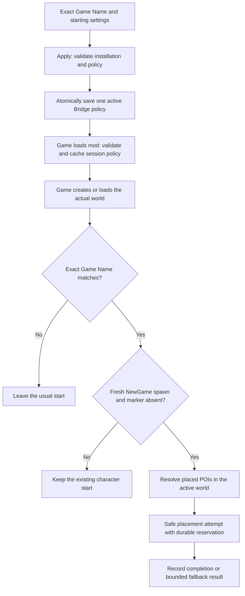

# Foundational setup: Game Name intent before a world exists

Recorded 2026-10-04 for HRS 1.2.7 / **New Player Random Start**.
This is an architecture reference for builds, setup changes and future handoffs.
The lane manifest, release contract and
source remain the authorities for the current implementation and qualification.

## The foundation

**Apply saves the player's starting intent under an exact Game Name before the
save or world needs to exist. The runtime resolves the actual world later,
when an eligible fresh character spawns in a matching game.**

This separates three decisions: the Game Name identifies the target game;
Standard/Random, biome preference and protection describe the intended start;
the character's first eligible arrival determines when placement may happen.
World age is independent of that character lifecycle. A supported existing
world can be used for a fresh character when the engine reports `NewGame`.
Loading an already-played character does not grant another random start.

Preparation requires a valid game installation and owned mod paths, but no
generated world, discovered save entry or save-directory parsing. The saved
policy contains no world path, world GUID or preselected landing coordinates.
The game creates or loads the world; HRS subsequently inspects its placed POIs.

For example, apply Random settings for `WreckedWeekend` today. Later, create
that named game using a supported world, or enter that named game as a fresh
character in a supported existing world. A matching first spawn can use those
settings. `wreckedweekend` does not match: comparison is case-sensitive.

## Producer, storage and consumer

Standard bypasses relocation. Runtime compatibility, local single-player,
EAC, entity, trader and placement guards still apply to the Random path.
Matching the name alone never authorizes relocation.

| Record | Location | Role |
| --- | --- | --- |
| Active configuration | `<GameRoot>/Mods/BitWrecked_HistoricalRandomStart/Bridge/policy.v2.json` | Manager writes `hrs-policy/v2`; runtime reads it once at mod initialization |
| Latest runtime outcome | Same Bridge folder, `result.v1.json` | Runtime writes `hrs-result/v1`; manager correlates policy revision and digest |
| Manager history | `<ManagerRoot>/ui/HistoricalRandomStart_State/history.v1.jsonl` | Records management actions and outcomes |
| Recovery list and snapshots | Same manager state folder, `recovery-index.v1.json` and `snapshots/` | Retains five recent attempts and available known-good policies for explicit recovery |
| Player placement marker | Game-persisted player custom variable `bitwrecked_hrs_state_v1` | Absent, Reserved or Completed state prevents repeat placement; other values are invalid |

In this DEV lane, `ManagerRoot` is `hrs_1.2.7/dev`; a customer package uses
its package root. Manager support records are separate from installed Bridge
configuration. The runtime does not read the history or recovery list.

There is **one active policy per selected game installation**. Applying settings
for another Game Name replaces the active policy with a higher revision.
There is no launch-time loop over queued game configurations, automatic
selection from saved history, or implemented All Games target scope. The active
policy persists across launches until explicitly replaced or removed; a
character's marker governs whether that character has already used its start.

## Current source trace

| Boundary | Implementation |
| --- | --- |
| Name and intent | Manager Apply in p0158.ps1 validates the exact name, advances revision and calls `New-HrsPolicy`; m0161.psm1 constructs the v2 policy and digest |
| Deployment and persistence | `Invoke-HrsInstallAndApply` in m0162.psm1 verifies/deploys the owned payload and calls `Write-HrsAppliedPolicy`; m0161.psm1 writes the single Bridge policy using atomic replacement and validated readback |
| Launch boundary | Manager Launch in p0158.ps1 calls `Test-HrsLaunchInstallation` in m0162.psm1, then starts the game; it does not discover or create a save |
| Runtime initialization | `OwnedBridgePaths.TryResolve` in c0184.cs resolves paths from the deployed mod; `PolicyV2Codec.TryRead` in PolicyV2.cs validates independently; `InitMod` in c0167.cs caches `sessionPolicy` and registers handlers |
| Exact target | `RuntimeEnvironmentGuard.DenialReason` in c0213.cs compares `EnumGamePrefs.GameName` with `policy.GameName` using `StringComparison.Ordinal`; `IsStillApproved` rechecks the context during placement |
| First-arrival eligibility | `OnPlayerSpawned` in c0167.cs distinguishes `LoadedGame` from `NewGame` and checks placement markers; `ObserveLoadedMarker` preserves completed starts and rejects loading an unmarked existing character as a new placement |
| Actual-world lookup | `PlacedPoiResolver.TrySelect` in PlacedPoiResolver.cs indexes the active world's placed prefabs via `GetWorldPrefabs`, with a cache tied to world reference/GUID; it applies biome preference to that world's eligible placements |
| Durable attempt | `StartPlacement` in c0167.cs reserves through MarkerStore before movement; completion persists the no-repeat state, while session guards bound retries |
| Management history | Get-HrsManagerStatePaths and Add-HrsRecoveryAttempt manage support records; they do not dispatch runtime commands |

The static historical Navezgane catalog still present in `c0213.cs` is not the
current spawn handler's resolver. Follow the `PlacedPoiResolver.TrySelect`
call in `c0167.cs` when reviewing actual-world selection.

## Build and setup invariants to preserve

1. Allow valid Game Names to be configured before their world or save exists.
   Do not add save enumeration, world-generation or save-existence requirements
   to Apply or Launch as a substitute for the runtime target check.
2. Keep **Game Name** distinct from the world's name. Preserve the validated
   value exactly, including case; reject invalid whitespace or noncanonical
   names rather than silently changing the target identity.
3. Keep the PowerShell writer and compiled C# reader in agreement on schema,
   field order, UTF-8 encoding and digest input. Retain owned-path checks,
   bounded atomic writes, readback and increasing revisions. A legacy v1 policy
   requires explicit manager migration; simultaneous v1/v2 files are ambiguous.
4. Apply with the game closed. Treat the runtime policy as a session snapshot:
   edits in the form are not applied settings, and the runtime does not watch
   the policy file for live changes. Launch is separate from Apply.
5. Preserve the fixed fresh-character trigger and durable no-repeat marker.
   A matching Game Name, different biome preference or newer policy revision
   does not make an already-played character eligible again.
6. Resolve POIs, terrain and traders from the active world and retain world
   identity checks during deferred work. Keep bounded safe-placement fallback
   rather than guessing coordinates from a world that was never loaded.
7. Keep active configuration, management history and runtime outcome separate.
   Any future multi-game policy list or broader target scope requires an
   explicit design and acceptance contract; a recovery list does not implement it.

These are existing architecture constraints, not a request to reimplement the
bridge. The pinned b17 build recipe and current build provenance remain in
the lane build notes.

## Why this was foundational

The preserved planning material confirms the owner's recollection of a list.
The original plan
proposed an external world/game-name index and five recent saves. Its dated
**2026-08-21** decision then narrowed the first local bridge to one exact-name
target; discovered-game mutation and All Games remained planned scopes.
Those older UI proposals are historical intent, not the current contract.

The reasoning log
explicitly permits targeting a not-yet-created game and separates target scope
from the fixed fresh-player trigger. The execution packet
defines the original `policy.v1.json` bridge, atomic write/readback and one
immutable runtime session intent. The August 21 change record
calls the exact-name frontend-to-runtime bridge the **first complete increment**.

The methods whitepaper explains the
engineering purpose: explicit name-bound intent avoids ambiguous save identity,
save parsing, concurrent indexes and unintended authority over existing games.
This is the earliest explicit foundation decision found in the inspected records;
their earlier filename dates should not be substituted for the August 21 decision.

## Evidence and qualification boundary

This document comes from a read-only source and historical-record study. No
runtime behavior, UI, game installation, candidate or test disposition changed.
Existing compiled-policy checks
cover seven canonical vectors and tamper rejection through the 1.2.7 DLL.
The bootstrap callback receipt
covers controlled management/launch fixtures and retains its original manager
source binding. Neither record independently qualifies existing-world gameplay.

The current customer requirements remain Navezgane or Random Gen 8192+, local
single-player with EAC disabled, targeting V3.3.0 b17. Bundled pregens and custom
maps remain outside the tested scope. The setup mechanism does not promise
successful placement in every arbitrary world. All 46 independent 1.2.7 QA
cases remain Pending; documentation adds no gameplay passes or release approval.
